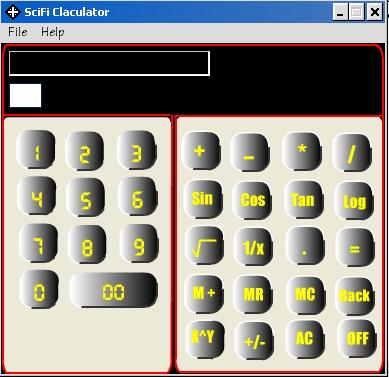



## SciFi Calciculatro

### Description

Hi friends,this is a scientific calculator designed and developed by Rajiv V Jathan

actually this is the upgraded version of the Scientific calculator created by my own my friend Priyank R Panchal.

We enjoy doing such stuffs.

Right now we are working on a project for a small firm.

This calculator is not perfect i accept that.Currently it can perform operations with two operands only (a+b and not a+b+c).So please mail some feedback on this calculator

to rajiv_load@yahoo.co.in

hope u enjoyed it.............
 
### More Info
 
numbers

             |
---                |---
**Submitted On**   |2004-05-14 11:32:00
**By**             |[Rajiv V Jathan](https://github.com/Planet-Source-Code/PSCIndex/blob/master/ByAuthor/rajiv-v-jathan.md)
**Level**          |Beginner
**User Rating**    |4.0 (8 globes from 2 users)
**Compatibility**  |VB 6\.0
**Category**       |[Math/ Dates](https://github.com/Planet-Source-Code/PSCIndex/blob/master/ByCategory/math-dates__1-37.md)
**World**          |[Visual Basic](https://github.com/Planet-Source-Code/PSCIndex/blob/master/ByWorld/visual-basic.md)
**Archive File**   |[SciFi\_Calc1746545172004\.zip](https://github.com/Planet-Source-Code/rajiv-v-jathan-scifi-calciculatro__1-53838/archive/master.zip)

